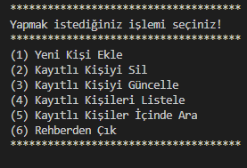
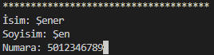
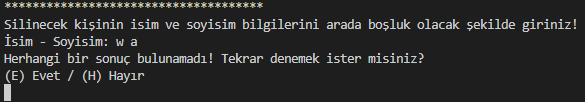
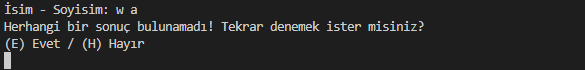
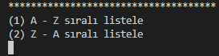
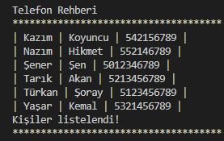
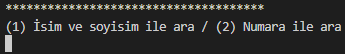
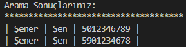

# PatikaAcademy.dev / Başlangıç Seviyesi .Net Core Patikası / PROJE-1 : Console Telefon Rehberi Uygulaması
Bu proje **PatikaAcademy.dev** platformunun **Başlangıç Seviyesi .Net Core Patikası** eğitimi kapsamında **PROJE-1 : Console Telefon Rehberi Uygulaması** dersi için yapılmıştır.

| Projenin İçeriği | |
| :-:|:-: |
| 1 | README.md |
| 1 | .gitignore |
| 1 | LICENSE |
| 1 | Console Application |
| 9 | gorseller/fotograflar |

## Installation
Öncelikle projeyi klonlayın.

```
git clone https://github.com/vahdetsavci/telefon-rehberi.git
```

## Usage
Projeyi klonladıktan sonra **Visual Studio Code** programında açınız.

```
cd telefon-rehberi
code .
```

Bu proje bir telefon rehberi uygulaması olarak aşağıda yer alan özellikleri barındırır.

1. Telefon Numarası Kaydet
2. Telefon Numarası Sil
3. Telefon Numarası Güncelle
4. Rehber Listeleme (A-Z, Z-A seçimli)
5. Rehberde Arama

### Açıklama
* Uygulama ilk açıldığında varsayılan olarak 5 kişinin numarası rehbere kaydedilir ve uygulama kullanıcıya sunulur.

* Uygulama ilk açıldığında kullanıcıya seçenekler sunulur. Sunulan seçenekler arasından kullanıcının bir seçim yapması beklenir. Kullanıcı seçim yaptığında seçilen işlem çalışır.



#### (1) Yeni Kişi Ekle


#### (2) Kayıtlı Kişiyi Sil


* Aranan kişi rehberde bulunamazsa; 



* Aranan kişi rehberde bulunursa;


* **Not:** Uygun kriterlere sahip birden fazla kişi bulunursa ilk bulunan silinir.

#### (3) Kayıtlı Kişiyi Güncelle


* Aranan kişi rehberde bulunamazsa;



* **Not:** Uygun kriterlere sahip birden fazla kişi bulunursa ilk bulunan silinir.

#### (4) Kayıtlı Kişileri Listele


Tüm rehber aşağıdaki formatta listelenir.



#### (5) Kayıtlı Kişiler İçinde Ara





#### (6) Rehberden Çık
Kullanıcı bu seçeneği seçerek uygulayı sonlandırır.

# LICENSE
[MIT](LICENSE)